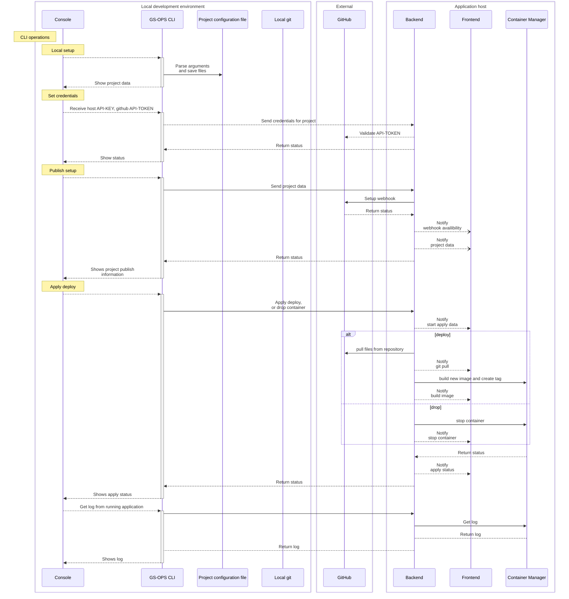
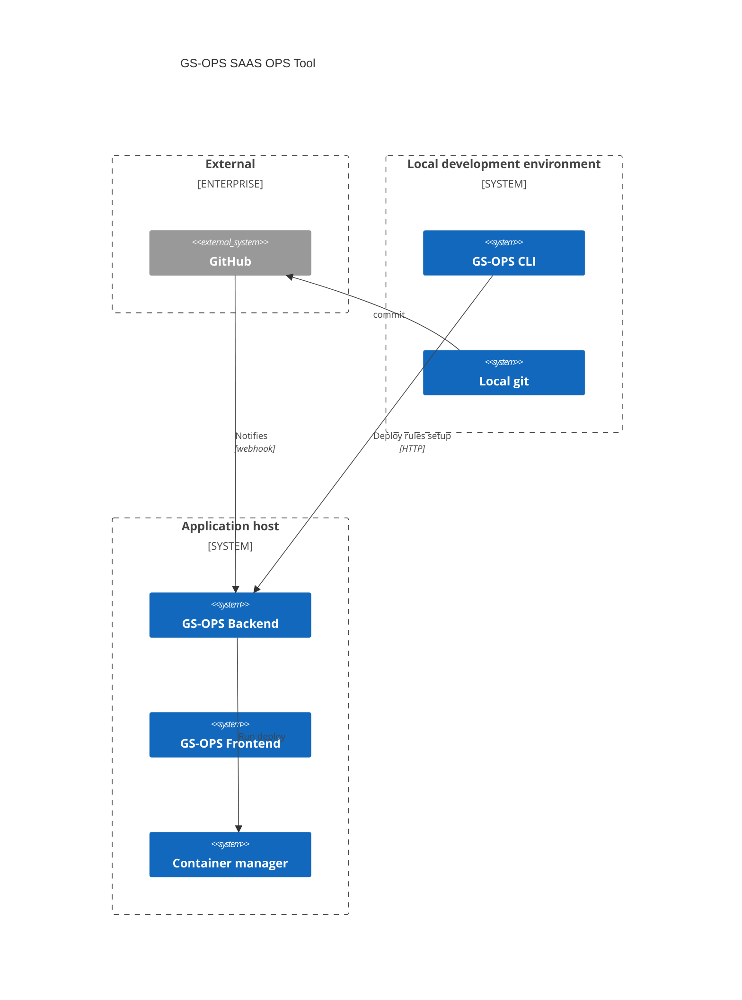

# gs-ops

Self hosted OPS application

## Architecture

### Local repository

```
└── .gsops
    ├── host.yaml
    └── project.yaml
```

.gsops/project.yaml

```yaml
name: test-project
description: "Description of the project"
repository-url: https://github.com/guionardo/project
deploy-branch: main
```

.gsops/host.yaml

```yaml
host: https://ops.guiosoft.info
api-key: XXXXXXXXXXX
```






